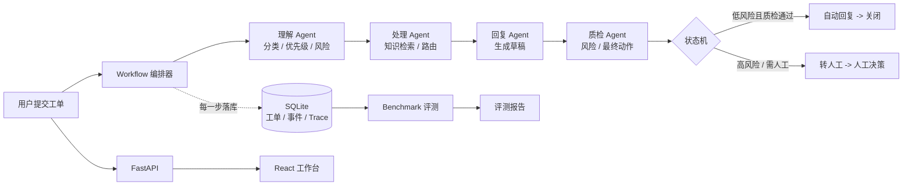

# 链路流程图

```mermaid
flowchart LR
    U[用户提交工单] --> W[Workflow 编排器]
    W --> A1[理解 Agent<br/>分类 / 优先级 / 风险]
    A1 --> A2[处理 Agent<br/>知识检索 / 路由]
    A2 --> A3[回复 Agent<br/>生成草稿]
    A3 --> A4[质检 Agent<br/>风险 / 最终动作]
    A4 --> SM{状态机}
    SM -->|低风险且质检通过| C1[自动回复 -> 关闭]
    SM -->|高风险 / 需人工| C2[转人工 -> 人工决策]
    W -.每一步落库.-> DB[(SQLite<br/>工单 / 事件 / Trace)]
    DB --> B[Benchmark 评测]
    B --> R[评测报告]
    U --> API[FastAPI]
    API --> UI[React 工作台]
```
